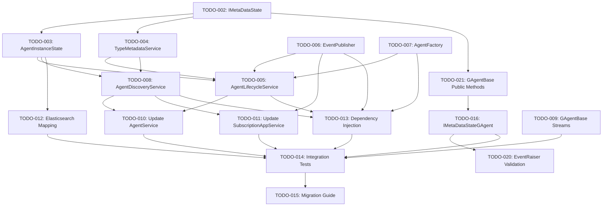

# Agent Architecture Migration TODOs

This directory contains detailed task breakdowns for migrating from the current CreatorGAgent architecture to the new service-based architecture as outlined in the Agent-Management-Architecture-Proposal.md and AgentRegistry-ElasticSearch-Lite.md documents.

## Overview

The migration involves replacing the CreatorGAgent proxy layer with specialized services that provide better separation of concerns, improved performance, and enhanced scalability while maintaining all existing functionality.

## Task Structure

Each TODO file follows a consistent structure:

- **Task Overview**: Brief description of what needs to be accomplished
- **Description**: Detailed explanation of the task requirements
- **Acceptance Criteria**: Specific, measurable criteria for task completion
- **Implementation Details**: Technical specifications and code examples
- **Dependencies**: Other tasks or systems that must be completed first
- **Testing Requirements**: Unit, integration, and performance testing needs
- **Priority**: High, Medium, or Low priority classification

## Implementation Phases

### Phase 1: Foundation (High Priority)
Core components that other services depend on:

1. **[TODO-002: IMetaDataState Interface](./TODO-002-IMetaDataState.md)** - ✅ **COMPLETED** - Foundation interface for state management
2. **[TODO-021: GAgentBase Public Methods](./TODO-021-GAgentBase-Public-Methods.md)** - ✅ **COMPLETED** - Make RaiseEvent and ConfirmEvents public for interface compatibility
3. **[TODO-016: IMetaDataStateGAgent](./TODO-016-IMetaDataStateGAgent.md)** - Helper interface with TDD implementation, tests, and documentation
4. **[TODO-003: AgentInstanceState](./TODO-003-AgentInstanceState.md)** - Concrete state implementation
5. **[TODO-004: TypeMetadataService](./TODO-004-TypeMetadataService.md)** - Static type information service
6. **[TODO-005: AgentLifecycleService](./TODO-005-AgentLifecycleService.md)** - CRUD operations service
7. **[TODO-006: EventPublisher](./TODO-006-EventPublisher.md)** - Orleans streams event publishing
8. **[TODO-007: AgentFactory](./TODO-007-AgentFactory.md)** - Standardized agent creation
9. **[TODO-008: AgentDiscoveryService](./TODO-008-AgentDiscoveryService.md)** - Elasticsearch-based discovery

### Phase 2: Infrastructure (Medium Priority)
Supporting infrastructure and integration:

10. **[TODO-009: GAgentBase Streams](./TODO-009-GAgentBase-Streams.md)** - Enhanced stream support
11. **[TODO-010: Update AgentService](./TODO-010-Update-AgentService.md)** - Service layer migration
12. **[TODO-011: Update SubscriptionAppService](./TODO-011-Update-SubscriptionAppService.md)** - Subscription service migration
13. **[TODO-012: Elasticsearch Mapping](./TODO-012-Elasticsearch-Mapping.md)** - Optimized index mapping
14. **[TODO-013: Dependency Injection](./TODO-013-DependencyInjection.md)** - Service configuration
15. **[TODO-020: EventRaiser Validation](./TODO-020-EventRaiser-Validation.md)** - Parameter validation and error handling

### Phase 3: Validation and Migration (Low Priority)
Testing and migration procedures:

16. **[TODO-014: Integration Tests](./TODO-014-Integration-Tests.md)** - Comprehensive testing suite
17. **[TODO-015: Migration Guide](./TODO-015-Migration-Guide.md)** - Migration procedures and documentation

## Dependency Graph

## Getting Started

### For Individual Tasks

1. **Choose a task** from Phase 1 (high priority) that has no pending dependencies
2. **Read the full task description** in the corresponding TODO file
3. **Check dependencies** are completed or can be mocked for testing
4. **Follow the TDD approach**: Write tests first, then implement
5. **Update the task status** and notify the team when complete

### For Project Management

1. **Track progress** using the dependency graph to understand blockers
2. **Assign tasks** based on team member expertise and availability
3. **Monitor critical path** through Phase 1 tasks to avoid delays
4. **Review completed tasks** before marking dependencies as satisfied
5. **Plan integration points** early to avoid last-minute integration issues

## Testing Strategy

Each task includes specific testing requirements:

- **Unit Tests**: Test individual components in isolation
- **Integration Tests**: Test service interactions and external dependencies
- **Performance Tests**: Validate performance requirements are met
- **Migration Tests**: Ensure data integrity during migration

## Success Metrics

### Technical Metrics
- All API endpoints maintain existing functionality
- Performance equal or better than current implementation
- Zero data loss during migration
- 99.9% uptime during migration process

### Quality Metrics
- 90%+ code coverage for new services
- All integration tests passing
- Performance benchmarks met
- Security requirements satisfied

## Risk Mitigation

### High-Risk Areas
- **Data Migration**: Risk of data loss or corruption
- **Orleans Integration**: Potential clustering issues
- **Performance**: Risk of performance degradation
- **API Compatibility**: Breaking changes to existing APIs

### Mitigation Strategies
- Comprehensive testing at each phase
- Feature flags for gradual rollout
- Automated rollback procedures
- Performance monitoring and alerting
- Parallel operation during migration

## Communication

### Status Updates
- Daily standup updates on task progress
- Weekly architecture review meetings
- Bi-weekly stakeholder updates
- Monthly migration progress reports

### Documentation
- Keep task files updated with progress
- Document any deviations from original plans
- Update architecture diagrams as needed
- Maintain changelog of completed tasks

## Support and Questions

For questions about specific tasks:
1. Review the task file thoroughly
2. Check dependencies and related tasks
3. Consult the original architecture proposals
4. Reach out to the architecture team for clarification

For technical issues:
1. Check existing documentation and code
2. Review similar implementations in the codebase
3. Consult Orleans and Elasticsearch documentation
4. Engage with the development team for assistance

---

**Next Steps**: Start with TODO-002 (IMetaDataState Interface) and TODO-021 (GAgentBase Public Methods) as they're foundational for the entire architecture migration.