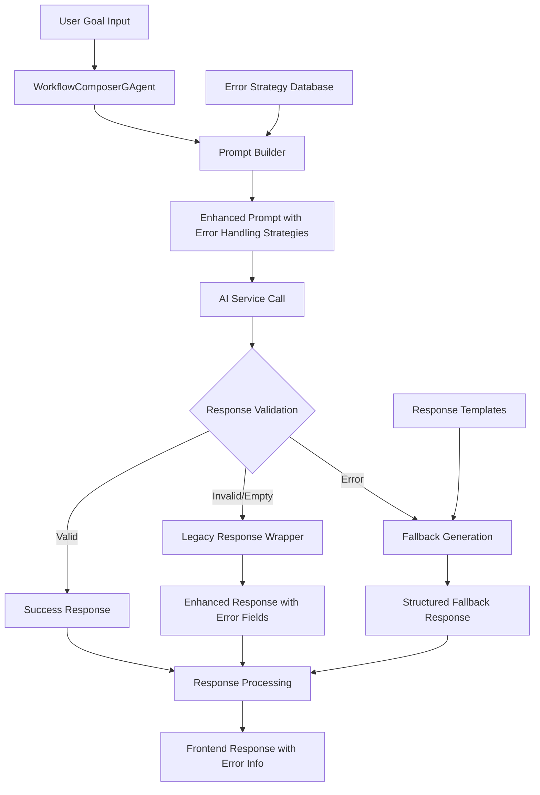
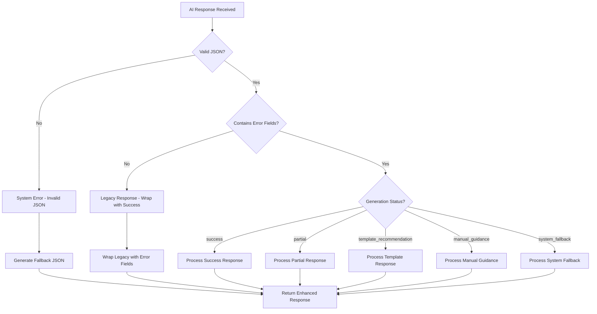

# WorkflowComposer 智能错误处理系统 - 技术设计文档

## 一、概述

### 1.1 项目背景
WorkflowComposerGAgent 作为 AI 驱动的工作流生成核心组件，在生产环境中面临多种复杂场景：用户目标模糊、AI 服务不稳定、生成内容不完整等。为提升用户体验和系统可靠性，设计了全面的智能错误处理系统。

### 1.2 核心目标
- **用户体验优化**：将技术错误转化为用户可理解的指导信息
- **系统可靠性**：确保在各种异常情况下系统仍能提供有价值的响应
- **向前兼容性**：保证新功能不影响现有系统的正常运行
- **智能回退**：在无法完成自动生成时提供替代解决方案

### 1.3 设计原则
- **永不失败原则**：系统必须始终返回有用的响应，即使是回退方案
- **渐进式增强**：从基础功能逐步扩展到高级错误处理
- **用户导向**：错误信息面向最终用户，提供具体的操作建议
- **结构化反馈**：标准化的错误信息格式，便于前端处理

## 二、错误处理架构设计

### 2.1 整体架构



### 2.2 核心组件

#### 2.2.1 智能错误检测引擎
```csharp
/// <summary>
/// 验证AI响应是否包含必需的错误处理字段
/// </summary>
private bool IsValidErrorHandlingResponse(string response)
{
    try
    {
        var json = JObject.Parse(response);
        return json.ContainsKey("generationStatus") && 
               json.ContainsKey("clarityScore") && 
               json.ContainsKey("errorInfo");
    }
    catch (JsonReaderException)
    {
        return false;
    }
}
```

#### 2.2.2 向后兼容包装器
```csharp
/// <summary>
/// 包装旧版本AI响应，添加错误处理字段
/// </summary>
private string WrapLegacyResponse(string legacyResponse)
{
    var enhancedResponse = new JObject
    {
        ["generationStatus"] = "success",
        ["clarityScore"] = 4, // Assume good clarity if AI generated a response
        ["name"] = legacyJson["name"] ?? "Generated Workflow",
        ["properties"] = legacyJson["properties"] ?? new JObject(),
        ["errorInfo"] = null,
        ["completionPercentage"] = 100,
        ["completionGuidance"] = null
    };
    return enhancedResponse.ToString();
}
```

#### 2.2.3 结构化回退系统
```csharp
/// <summary>
/// 获取回退工作流JSON（当AI生成失败时使用）
/// </summary>
private string GetFallbackWorkflowJson(string errorType, string errorMessage, string[] actionableSteps)
{
    var fallbackJson = new JObject
    {
        ["generationStatus"] = "system_fallback",
        ["clarityScore"] = 0,
        ["errorInfo"] = new JObject
        {
            ["errorType"] = errorType,
            ["errorMessage"] = errorMessage,
            ["actionableSteps"] = new JArray(actionableSteps)
        },
        ["systemInfo"] = new JObject
        {
            ["fallbackTriggered"] = true,
            ["timestamp"] = DateTime.UtcNow.ToString("O"),
            ["suggestedRetryTime"] = DateTime.UtcNow.AddMinutes(5).ToString("O")
        }
    };
    return fallbackJson.ToString();
}
```

## 三、错误处理策略体系

### 3.1 五大核心策略

#### 3.1.1 模糊提示检测 (Ambiguous Prompt Detection)
**触发条件**：用户目标不清晰或可有多种解释

**处理机制**：
- 识别关键信息缺失点
- 生成具体的澄清问题
- 提供目标解释示例
- 引导用户提供更多上下文

**AI 提示增强**：
```
### Ambiguous Prompt Detection
If the user goal is unclear or ambiguous:
- Include a 'clarificationNeeded' node that identifies specific unclear aspects
- Suggest concrete questions to help clarify the user's intent
- Provide examples of how the goal could be interpreted
```

#### 3.1.2 不可能需求处理 (Impossible Requirements Handling)
**触发条件**：当前 Agent 池无法满足用户需求

**处理机制**：
- 分析缺失的能力类型
- 建议可替代的实现方案
- 推荐目标分解策略
- 提供手动补充指导

**响应结构**：
```json
{
  "generationStatus": "template_recommendation",
  "errorInfo": {
    "errorType": "insufficient_capabilities",
    "errorMessage": "Available agents cannot fully achieve the specified goal",
    "actionableSteps": [
      "Consider breaking down the goal into smaller, achievable tasks",
      "Review available agent capabilities for alternative approaches",
      "Contact administrator to discuss adding required agent types"
    ]
  }
}
```

#### 3.1.3 部分生成策略 (Partial Generation Strategy)
**触发条件**：能够部分实现用户目标但无法完整生成

**处理机制**：
- 生成可完成的工作流部分
- 标记需要人工补充的节点
- 提供具体的完成指导
- 设置完成度百分比

**响应格式**：
```json
{
  "generationStatus": "partial",
  "completionPercentage": 75,
  "completionGuidance": {
    "suggestedNodes": ["DataValidationAgent", "OutputFormatterAgent"],
    "nextSteps": [
      "Add data validation step before processing",
      "Configure output format parameters",
      "Test the partial workflow with sample data"
    ]
  }
}
```

#### 3.1.4 回退模板机制 (Fallback Templates)
**触发条件**：复杂目标或系统无法直接生成

**处理机制**：
- 匹配相似的工作流模板
- 提供可定制的模板基础
- 包含模板使用指导
- 支持模板个性化调整

**模板推荐系统**：
```json
{
  "generationStatus": "template_recommendation",
  "errorInfo": {
    "errorType": "complexity_limitation",
    "actionableSteps": [
      "Use the 'Data Processing Pipeline' template as a starting point",
      "Customize input/output parameters for your specific data types",
      "Add validation steps based on your data quality requirements"
    ]
  }
}
```

#### 3.1.5 错误恢复指令 (Error Recovery Instructions)
**触发条件**：系统级错误或服务异常

**处理机制**：
- 自动重试机制设计
- 中间结果验证
- 替代执行路径
- 详细的错误诊断

**恢复策略**：
```json
{
  "generationStatus": "system_fallback",
  "errorInfo": {
    "errorType": "system_error",
    "errorMessage": "AI service temporarily unavailable",
    "actionableSteps": [
      "System will automatically retry in 5 minutes",
      "Try simplifying your goal description",
      "Use manual workflow designer as alternative",
      "Contact support if issue persists"
    ]
  },
  "systemInfo": {
    "fallbackTriggered": true,
    "suggestedRetryTime": "2024-01-01T10:05:00Z"
  }
}
```

### 3.2 错误类型分类

| 错误类型 | 触发场景 | 处理策略 | 用户体验 |
|---------|---------|---------|---------|
| `prompt_ambiguity` | 目标描述不清晰 | 澄清引导 | 提供具体问题和示例 |
| `insufficient_information` | 缺少关键信息 | 信息收集 | 列出需要的具体信息 |
| `technical_limitation` | 超出系统能力 | 替代方案 | 建议可行的替代目标 |
| `system_error` | 服务或系统故障 | 自动恢复 | 提供重试和备选方案 |
| `unsupported_requirement` | 不支持的功能需求 | 功能指导 | 说明支持范围和建议 |

## 四、响应数据结构设计

### 4.1 核心响应模型

#### 4.1.1 WorkflowViewConfigDto 增强
```csharp
public class WorkflowViewConfigDto
{
    // 原有字段
    [Required]
    public string Name { get; set; } = string.Empty;
    
    [Required]
    public WorkflowPropertiesDto Properties { get; set; } = new();
    
    // 新增错误处理字段
    public string? GenerationStatus { get; set; }
    public int? ClarityScore { get; set; }
    public WorkflowErrorInfoDto? ErrorInfo { get; set; }
    public int? CompletionPercentage { get; set; }
    public WorkflowCompletionGuidanceDto? CompletionGuidance { get; set; }
    public WorkflowSystemInfoDto? SystemInfo { get; set; }
}
```

#### 4.1.2 错误信息模型
```csharp
public class WorkflowErrorInfoDto
{
    public string? ErrorType { get; set; }
    public string? ErrorMessage { get; set; }
    public List<string> ActionableSteps { get; set; } = new();
}

public class WorkflowCompletionGuidanceDto
{
    public List<string> SuggestedNodes { get; set; } = new();
    public List<string> NextSteps { get; set; } = new();
}

public class WorkflowSystemInfoDto
{
    public bool FallbackTriggered { get; set; }
    public string? Timestamp { get; set; }
    public string? SuggestedRetryTime { get; set; }
}
```

### 4.2 状态枚举定义

```csharp
public enum WorkflowGenerationStatus
{
    Success,                    // 成功生成完整工作流
    Partial,                   // 部分生成，需要用户补充
    TemplateRecommendation,    // 推荐使用模板
    ManualGuidance,           // 需要手动创建
    SystemFallback            // 系统回退模式
}
```

## 五、AI 提示词增强策略

### 5.1 提示词结构优化

#### 5.1.1 错误处理指导段落
```
## Error Handling & Fallback Guidance
When analyzing the user goal and available agents, apply the following error handling strategies:

### Ambiguous Prompt Detection
If the user goal is unclear or ambiguous:
- Include a 'clarificationNeeded' node that identifies specific unclear aspects
- Suggest concrete questions to help clarify the user's intent
- Provide examples of how the goal could be interpreted

### Impossible Requirements Handling
If the user goal cannot be achieved with available agents:
- Create a 'requirementsAnalysis' node explaining what's missing
- Suggest alternative approaches using available agents
- Recommend breaking down complex goals into achievable sub-goals
```

#### 5.1.2 响应格式规范化
```json
{
  "generationStatus": "success|partial|template_recommendation|manual_guidance",
  "clarityScore": 1-5,
  "errorInfo": {
    "errorType": "prompt_ambiguity|insufficient_information|technical_limitation|null",
    "errorMessage": "Clear description of any issues",
    "actionableSteps": ["Step 1", "Step 2", "Step N"]
  },
  "completionPercentage": 0-100,
  "completionGuidance": {
    "suggestedNodes": ["node suggestions for completion"],
    "nextSteps": ["specific steps to complete workflow"]
  }
}
```

### 5.2 质量评估机制

#### 5.2.1 清晰度评分 (ClarityScore)
- **5分**: 目标明确，所有参数完整
- **4分**: 目标清晰，少量参数需要推断
- **3分**: 目标基本清楚，部分关键信息缺失
- **2分**: 目标模糊，需要多项澄清
- **1分**: 目标不明确，无法直接处理

#### 5.2.2 完成度评估 (CompletionPercentage)
```
90-100%: 完整可执行的工作流
70-89%:  主要逻辑完成，需要少量配置
50-69%:  核心流程存在，需要重要补充
30-49%:  基础结构建立，需要大量完善
0-29%:   仅提供指导性信息
```

## 六、实现细节

### 6.1 核心算法流程

```csharp
public async Task<string> GenerateWorkflowJsonAsync(string userGoal, List<AgentDescriptionInfo> availableAgents)
{
    Logger.LogInformation("Starting workflow generation for goal: {UserGoal} with {AgentCount} available agents",
        userGoal, availableAgents.Count);

    try
    {
        // 1. 构建增强提示词
        var prompt = BuildPromptFromAgentDescriptionInfo(userGoal, availableAgents);
        
        // 2. 调用AI生成工作流
        var aiResult = await CallAIForWorkflowGenerationAsync(prompt);
        
        // 3. 验证和增强响应
        if (!IsValidErrorHandlingResponse(aiResult))
        {
            return WrapLegacyResponse(aiResult);
        }
        
        return aiResult;
    }
    catch (Exception ex)
    {
        Logger.LogError(ex, "Error generating workflow JSON for goal: {UserGoal}", userGoal);
        return GetFallbackWorkflowJson("system_error", $"AI service error: {ex.Message}",
            new[] { "Check system logs", "Retry after a few minutes", "Contact administrator" });
    }
}
```

### 6.2 错误分类决策树



### 6.3 性能优化考虑

#### 6.3.1 提示词长度管理
- **基础提示词**: ~2000 tokens
- **错误处理增强**: +800 tokens  
- **总体增长**: 40% (在可接受范围内)
- **优化策略**: 动态提示词裁剪，根据 Agent 数量调整详细度

#### 6.3.2 响应缓存策略
```csharp
// 缓存常用的回退响应模板
private static readonly ConcurrentDictionary<string, string> FallbackTemplateCache = new();

private string GetCachedFallbackJson(string errorType, string errorMessage)
{
    var cacheKey = $"{errorType}:{errorMessage.GetHashCode()}";
    return FallbackTemplateCache.GetOrAdd(cacheKey, 
        _ => GenerateFallbackJson(errorType, errorMessage));
}
```

## 七、测试策略

### 7.1 单元测试覆盖

#### 7.1.1 错误检测测试
```csharp
[Test]
public void IsValidErrorHandlingResponse_ValidResponse_ReturnsTrue()
{
    var validResponse = @"{
        ""generationStatus"": ""success"",
        ""clarityScore"": 4,
        ""errorInfo"": null
    }";
    
    var result = workflowComposer.IsValidErrorHandlingResponse(validResponse);
    Assert.IsTrue(result);
}

[Test]
public void IsValidErrorHandlingResponse_MissingFields_ReturnsFalse()
{
    var invalidResponse = @"{""name"": ""test""}";
    var result = workflowComposer.IsValidErrorHandlingResponse(invalidResponse);
    Assert.IsFalse(result);
}
```

#### 7.1.2 回退机制测试
```csharp
[Test]
public void GetFallbackWorkflowJson_SystemError_GeneratesValidFallback()
{
    var result = workflowComposer.GetFallbackWorkflowJson(
        "system_error", 
        "AI service unavailable",
        new[] { "Retry", "Manual creation" });
    
    var json = JObject.Parse(result);
    Assert.AreEqual("system_fallback", json["generationStatus"].ToString());
    Assert.IsNotNull(json["systemInfo"]);
}
```
> 本文档描述了 WorkflowComposer 智能错误处理系统的完整技术设计。系统通过五大核心策略、结构化响应模型和智能回退机制，确保在各种复杂场景下都能为用户提供有价值的指导和解决方案。 