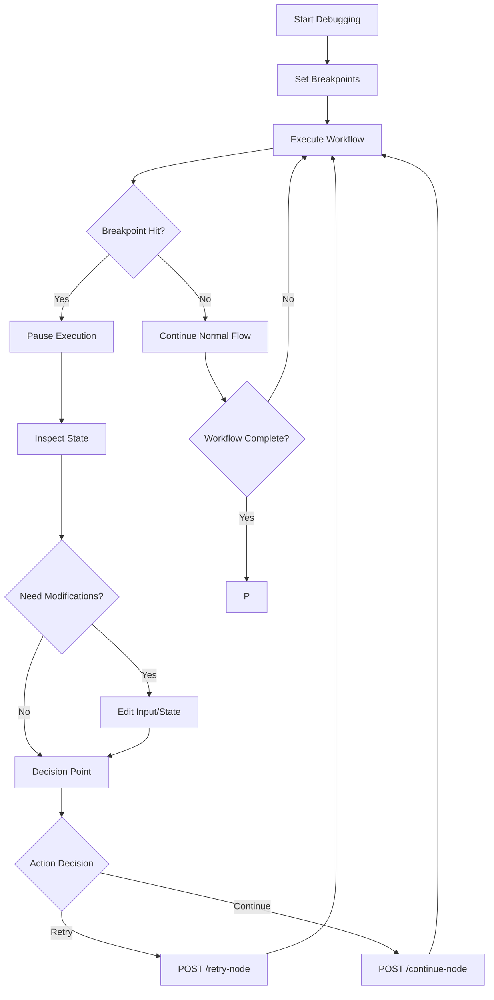
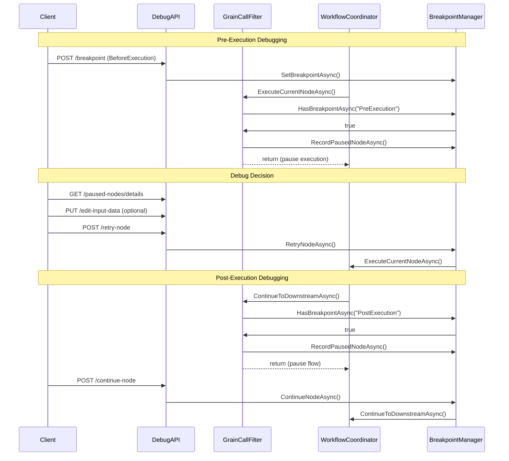

# Workflow Debug API Documentation

## Overview

The Workflow Debug API provides comprehensive debugging capabilities for workflow execution through a zero-intrusion Orleans Grain Call Filter mechanism. This API allows developers to set breakpoints, control execution flow, inspect and modify node states, and monitor debugging sessions in real-time.

**Base URL**: `/api/WorkflowDebugApi`  
**API Version**: 2.0.0  
**Architecture**: Dual Interception Strategy (Pre/Post execution control)

## Core Features

- ✅ **Zero-Intrusion Debugging**: No modification to existing workflow code required
- ✅ **Dual-Stage Control**: Pre-execution and post-execution breakpoints
- ✅ **Real-time Monitoring**: Live status of breakpoints and paused nodes
- ✅ **Parameter Editing**: Runtime modification of node input data and state
- ✅ **Batch Operations**: Multiple breakpoints management
- ✅ **Frontend-Friendly**: Uses simple `workflowId + nodeId` (term concept hidden)

---

## API Endpoints

### 🔴 Breakpoint Management

#### Set Breakpoint
```http
POST /api/WorkflowDebugApi/breakpoint
```

Set a debugging breakpoint for a specific workflow node.

**Request Body:**
```json
{
  "workflowId": "550e8400-e29b-41d4-a716-446655440000",
  "nodeId": "node-1",
  "type": "BeforeExecution", // BeforeExecution | AfterExecution | OnError | Conditional
  "condition": "content:error" // Optional, for conditional breakpoints
}
```

**Response:**
```json
{
  "success": true,
  "message": "Breakpoint set successfully"
}
```

#### Remove Breakpoint
```http
DELETE /api/WorkflowDebugApi/breakpoint/{workflowId}/{nodeId}
```

Remove a specific breakpoint.

**Response:**
```json
{
  "success": true,
  "message": "Breakpoint removed successfully"
}
```

#### Clear All Breakpoints
```http
DELETE /api/WorkflowDebugApi/breakpoint
```

Remove all existing breakpoints from the system.

#### Get Active Breakpoints
```http
GET /api/WorkflowDebugApi/breakpoint
```

Retrieve list of all active breakpoints.

**Response:**
```json
{
  "success": true,
  "data": [
    {
      "id": "guid",
      "workflowId": "550e8400-e29b-41d4-a716-446655440000",
      "nodeId": "node-1",
      "type": "BeforeExecution",
      "isEnabled": true,
      "hitCount": 3,
      "lastHitAt": "2024-01-15T10:30:00Z"
    }
  ]
}
```

#### Batch Set Breakpoints
```http
POST /api/WorkflowDebugApi/breakpoint/batch
```

Set multiple breakpoints in a single operation.

**Request Body:**
```json
{
  "breakpoints": [
    {
      "workflowId": "550e8400-e29b-41d4-a716-446655440000",
      "nodeId": "node-1",
      "type": "BeforeExecution"
    },
    {
      "workflowId": "550e8400-e29b-41d4-a716-446655440000", 
      "nodeId": "node-2",
      "type": "AfterExecution"
    }
  ]
}
```

---

### ⚡ Core Debug Control

#### Retry Node Execution
```http
POST /api/WorkflowDebugApi/retry-node
```

Re-execute a specific workflow node with modified parameters.

**Request Body:**
```json
{
  "workflowId": "550e8400-e29b-41d4-a716-446655440000",
  "nodeId": "node-1",
  "coordinatorMessages": [
    {
      "agentName": "ChatAgent",
      "content": "Modified input message",
      "timestamp": "2024-01-15T10:30:00Z"
    }
  ],
  "note": "Retry with corrected input"
}
```

**Response:**
```json
{
  "success": true,
  "message": "Node retry completed for node node-1",
  "data": "Retry successful"
}
```

#### Continue to Downstream
```http
POST /api/WorkflowDebugApi/continue-node
```

Continue execution to downstream nodes after current node completion.

**Request Body:**
```json
{
  "workflowId": "550e8400-e29b-41d4-a716-446655440000",
  "nodeId": "node-1",
  "note": "Results validated, continue execution"
}
```

#### Edit Node Input Data
```http
PUT /api/WorkflowDebugApi/edit-input-data
```

Modify input data for a specific workflow node during debugging.

**Request Body:**
```json
{
  "workflowId": "550e8400-e29b-41d4-a716-446655440000",
  "nodeId": "node-1",
  "inputData": "{\"param1\": \"modified_value\", \"param2\": 123}",
  "note": "Updated parameters for testing"
}
```

#### Edit Node State Data
```http
PUT /api/WorkflowDebugApi/edit-state-data
```

Modify state data for a specific workflow node.

**Request Body:**
```json
{
  "workflowId": "550e8400-e29b-41d4-a716-446655440000",
  "nodeId": "node-1", 
  "stateData": {
    "status": "modified",
    "counter": 42,
    "lastModified": "2024-01-15T10:30:00Z"
  },
  "note": "State correction for debugging"
}
```


---

### 📊 Status & Monitoring

#### Get Paused Nodes
```http
GET /api/WorkflowDebugApi/paused-nodes
```

Retrieve list of currently paused workflow nodes.

**Response:**
```json
{
  "success": true,
  "data": ["node-1", "node-3", "node-5"]
}
```

#### Get Paused Nodes Details
```http
GET /api/WorkflowDebugApi/paused-nodes/details
```

Get detailed information about paused nodes.

**Response:**
```json
{
  "success": true,
  "data": [
    {
      "workflowId": "550e8400-e29b-41d4-a716-446655440000",
      "nodeId": "node-1",
      "stage": "PreExecution",
      "pausedAt": "2024-01-15T10:30:00Z",
      "context": {
        "speaker": "guid",
        "term": 1,
        "coordinatorMessages": [...]
      },
      "note": "Paused at PreExecution stage"
    }
  ]
}
```


---

## Debug Workflow

### Standard Debugging Flow



### Pre-Execution vs Post-Execution Control



---

## Data Models

### BreakpointType Enum
```typescript
enum BreakpointType {
  BeforeExecution = 0,    // Pause before node execution
  AfterExecution = 1,     // Pause after node execution
  OnError = 2,           // Pause when error occurs
  Conditional = 3        // Pause when condition is met
}
```

### PauseStage Enum
```typescript
enum PauseStage {
  PreExecution = 0,      // Node about to execute
  PostExecution = 1      // Node execution completed
}
```

### ChatMessage Model
```typescript
interface ChatMessage {
  agentName: string;
  content: string;
  timestamp: string;
}
```

### ApiResponse Model
```typescript
interface ApiResponse<T> {
  success: boolean;
  message: string;
  data?: T;
  errorCode?: string;
}
```

---

## Usage Examples

### Basic Debugging Session

```bash
# 1. Set a breakpoint before node execution
curl -X POST "http://localhost:5000/api/WorkflowDebugApi/breakpoint" \
  -H "Content-Type: application/json" \
  -d '{
    "workflowId": "550e8400-e29b-41d4-a716-446655440000",
    "nodeId": "chatAgent-1", 
    "type": "BeforeExecution"
  }'

# 2. Execute workflow (will pause at breakpoint)

# 3. Check paused nodes
curl "http://localhost:5000/api/WorkflowDebugApi/paused-nodes/details"

# 4. Modify input data (optional)
curl -X PUT "http://localhost:5000/api/WorkflowDebugApi/edit-input-data" \
  -H "Content-Type: application/json" \
  -d '{
    "workflowId": "550e8400-e29b-41d4-a716-446655440000",
    "nodeId": "chatAgent-1",
    "inputData": "{\"message\": \"corrected input\"}"
  }'

# 5. Retry with modifications
curl -X POST "http://localhost:5000/api/WorkflowDebugApi/retry-node" \
  -H "Content-Type: application/json" \
  -d '{
    "workflowId": "550e8400-e29b-41d4-a716-446655440000",
    "nodeId": "chatAgent-1",
    "coordinatorMessages": [
      {
        "agentName": "UserInput",
        "content": "Please analyze the corrected data",
        "timestamp": "2024-01-15T10:30:00Z"
      }
    ]
  }'
```

### Batch Breakpoint Setup

```bash
curl -X POST "http://localhost:5000/api/WorkflowDebugApi/breakpoint/batch" \
  -H "Content-Type: application/json" \
  -d '{
    "breakpoints": [
      {
        "workflowId": "550e8400-e29b-41d4-a716-446655440000",
        "nodeId": "inputAgent",
        "type": "BeforeExecution"
      },
      {
        "workflowId": "550e8400-e29b-41d4-a716-446655440000", 
        "nodeId": "processAgent",
        "type": "AfterExecution"
      },
      {
        "workflowId": "550e8400-e29b-41d4-a716-446655440000",
        "nodeId": "outputAgent", 
        "type": "BeforeExecution"
      }
    ]
  }'
```

---

## Error Handling

All API endpoints return consistent error responses:

```json
{
  "success": false,
  "message": "Detailed error message",
  "errorCode": "ERROR_CODE"
}
```

### Common Error Codes

- `TERM_NOT_FOUND`: Unable to resolve term from workflowId and nodeId
- `RETRY_ERROR`: Failed to retry node execution
- `CONTINUE_ERROR`: Failed to continue to downstream
- `EDIT_INPUT_ERROR`: Failed to edit input data
- `EDIT_STATE_ERROR`: Failed to edit state data

---

## Best Practices

### 1. Breakpoint Management
- Use specific nodeId patterns for better organization
- Remove breakpoints when debugging session is complete
- Use conditional breakpoints for complex scenarios

### 2. Performance Considerations
- Limit the number of active breakpoints (recommended: < 50)
- Use batch operations for multiple breakpoints
- Monitor active breakpoints and paused nodes regularly

### 3. State Modifications
- Always validate input data format before editing
- Keep notes for tracking modifications during debugging
- Test modifications in isolation before applying to production workflows

### 4. Monitoring
- Monitor paused nodes to prevent workflow blocking
- Check active breakpoints status regularly
- Review paused node details for debugging progress

---

## Integration Guide

### Frontend Integration

```typescript
class WorkflowDebugClient {
  private baseUrl = '/api/WorkflowDebugApi';
  
  async setBreakpoint(workflowId: string, nodeId: string, type: BreakpointType) {
    const response = await fetch(`${this.baseUrl}/breakpoint`, {
      method: 'POST',
      headers: { 'Content-Type': 'application/json' },
      body: JSON.stringify({ workflowId, nodeId, type })
    });
    return await response.json();
  }
  
  async retryNode(workflowId: string, nodeId: string, messages: ChatMessage[]) {
    const response = await fetch(`${this.baseUrl}/retry-node`, {
      method: 'POST', 
      headers: { 'Content-Type': 'application/json' },
      body: JSON.stringify({ 
        workflowId, 
        nodeId, 
        coordinatorMessages: messages 
      })
    });
    return await response.json();
  }
  
  async getPausedNodes() {
    const response = await fetch(`${this.baseUrl}/paused-nodes/details`);
    return await response.json();
  }
}
```

### Real-time Updates

For real-time debugging updates, consider implementing WebSocket connections or SignalR hubs to receive notifications when:
- Breakpoints are hit
- Nodes are paused
- Execution status changes

---

## Conclusion

The Workflow Debug API provides a comprehensive, zero-intrusion debugging solution for complex workflow systems. With its dual-stage interception strategy and frontend-friendly design, developers can efficiently debug, modify, and monitor workflow executions without impacting the core workflow logic.

For more technical details, refer to the [Workflow Debug System Design](workflow-debug-system-design.md) document.
