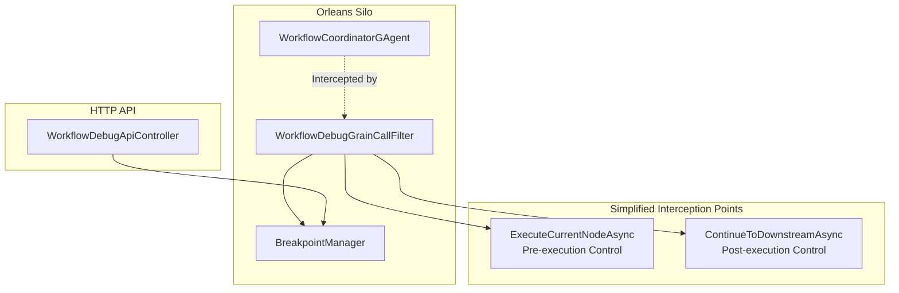

# Workflow Debug System - Technical Design

## Overview

Zero-intrusion workflow debugging system using Orleans Grain Call Filters for intercepting and controlling workflow execution without modifying the core `WorkflowCoordinatorGAgent`.

## Core Architecture



## Key Components

### 1. WorkflowDebugGrainCallFilter
- **Purpose**: Orleans `IIncomingGrainCallFilter` for zero-intrusion interception
- **Targets**: `ExecuteCurrentNodeAsync` (pre-execution) and `ContinueToDownstreamAsync` (post-execution)
- **Strategy**: Instant return on breakpoint hit, API-driven continuation
- **Simplification**: Only intercepts core workflow control methods

### 2. BreakpointManager
- **Purpose**: Core breakpoint and state management
- **Features**: 
  - Breakpoint CRUD operations
  - Paused node state tracking
  - Control commands (continue, retry, skip, abort)
  - Term resolution (internal handling of term ↔ nodeId mapping)
- **Storage**: In-memory with concurrent collections
- **API Design**: Frontend-friendly (only uses workflowId + nodeId)

### 3. WorkflowDebugApiController  
- **Purpose**: HTTP API for external debugging tools
- **Core Endpoints**:
  - `POST /api/WorkflowDebugApi/breakpoint` - Set breakpoints
  - `GET /api/WorkflowDebugApi/paused-nodes` - Get paused nodes
  - `POST /api/WorkflowDebugApi/retry-node` - Execute/retry node
  - `POST /api/WorkflowDebugApi/continue-node` - Continue to downstream
  - `PUT /api/WorkflowDebugApi/edit-input-data` - Edit node input data
  - `PUT /api/WorkflowDebugApi/edit-state-data` - Edit node state

## Control Flow

### Pre-execution Breakpoint (Debug Before Execution)
1. User calls `ExecuteCurrentNodeAsync` (via API or internal)
2. `WorkflowDebugGrainCallFilter` intercepts the call
3. Check pre-execution breakpoint conditions via `BreakpointManager.HasBreakpointAsync`
4. If breakpoint hit: Record paused state and return immediately
5. External API call to continue execution or modify parameters

### Post-execution Breakpoint (Debug After Execution)
1. User calls `ContinueToDownstreamAsync` (after reviewing execution results)
2. `WorkflowDebugGrainCallFilter` intercepts the call
3. Check post-execution breakpoint conditions 
4. If breakpoint hit: Record paused state and return immediately
5. External API call to continue to downstream or retry current node

### Simplified Debug Workflow
```
Set Breakpoint → ExecuteCurrentNodeAsync(Intercept) → Review → ContinueToDownstreamAsync(Intercept) → Complete
                          ↓                                            ↓
                    [PreExecution Pause]                        [PostExecution Pause]
                          ↓                                            ↓
                   API: retry/continue/abort                   API: continue/retry/abort
```

## Technical Implementation

### Core Interface Methods
- `ExecuteCurrentNodeAsync(long term, List<ChatMessage> coordinatorMessages)` - Execute/retry node
- `ContinueToDownstreamAsync(long term)` - Continue to downstream nodes

### Node ID & Term Resolution Strategy
- **Frontend**: Only uses `workflowId` + `nodeId` (simplified for developers)
- **Backend**: Internally resolves `nodeId` → `term` via `WorkflowCoordinatorState.TermToWorkUnitGrainId`
- **Breakpoint Keys**: `"{workflowId}:{nodeId}"`
- **Term Mapping**: Hidden from API, handled internally by `BreakpointManager`

### Instant Control Strategy  
- No `TaskCompletionSource` waiting or blocking
- Direct return from interceptor on breakpoint hit
- API-driven re-invocation via `ExecuteCurrentNodeAsync` or `ContinueToDownstreamAsync`
- Zero-waiting strategy for maximum responsiveness

### Simplified Interception Logic
```csharp
switch (methodName)
{
    case "ExecuteCurrentNodeAsync":     // Pre-execution breakpoint check
        await InterceptExecuteCurrentNodeAsync(context, workflowId);
        break;
        
    case "ContinueToDownstreamAsync":   // Post-execution breakpoint check  
        await InterceptContinueToDownstreamAsync(context, workflowId);
        break;
        
    default:
        await context.Invoke(); // Other methods pass through
        break;
}
```

## Key Features & Improvements

### Architecture Simplifications
- **Reduced Complexity**: Only 2 interception points (vs previous 4+)
- **Clear Semantics**: `ExecuteCurrentNodeAsync` & `ContinueToDownstreamAsync` are self-explanatory
- **Frontend Friendly**: Hidden term concept, only use `workflowId` + `nodeId`
- **Zero Configuration**: No special setup required for debugging

### API Design Excellence  
- **Consistent Response Format**: All APIs return `ApiResponse<T>` with success/error handling
- **RESTful Design**: Proper HTTP methods (POST/PUT/GET/DELETE)
- **Input Data Editing**: Runtime modification of node parameters
- **State Data Editing**: Direct manipulation of workflow state

## Testing Coverage

- **Unit Tests**: Comprehensive coverage of core debugging scenarios
- **Integration Tests**: End-to-end debugging workflows  
- **API Tests**: HTTP controller functionality with various edge cases
- **Filter Tests**: Orleans interception logic validation
- **Performance Tests**: Zero-latency interception verification

## Benefits

- ✅ **Zero Intrusion**: No changes to existing `WorkflowCoordinatorGAgent` code
- ✅ **Instant Control**: No blocking waits, immediate response and control
- ✅ **Simplified Architecture**: Only 2 core interception points
- ✅ **Frontend Friendly**: Hidden complexity, simple workflowId + nodeId API
- ✅ **Comprehensive Control**: Pre/post execution + parameter/state editing
- ✅ **Scalable**: Orleans-native distributed debugging across silos
- ✅ **Developer Experience**: Clear method names and intuitive control flow
