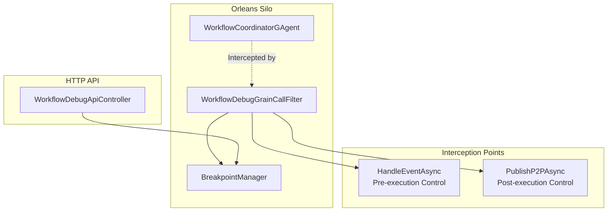

# Workflow Debug System - Technical Design

## Overview

Zero-intrusion workflow debugging system using Orleans Grain Call Filters for intercepting and controlling workflow execution without modifying the core `WorkflowCoordinatorGAgent`.

## Core Architecture

## Key Components

### 1. WorkflowDebugGrainCallFilter
- **Purpose**: Orleans `IIncomingGrainCallFilter` for zero-intrusion interception
- **Targets**: `HandleEventAsync` (pre-execution) and `PublishP2PAsync` (post-execution)
- **Strategy**: Instant return on breakpoint hit, API-driven continuation

### 2. BreakpointManager
- **Purpose**: Core breakpoint and state management
- **Features**: 
  - Breakpoint CRUD operations
  - Paused node state tracking
  - Control commands (continue, retry, skip, abort)
- **Storage**: In-memory with concurrent collections

### 3. WorkflowDebugApiController  
- **Purpose**: HTTP API for external debugging tools
- **Endpoints**:
  - `POST /api/workflow-debug/breakpoints` - Set breakpoints
  - `GET /api/workflow-debug/paused-nodes` - Get paused nodes
  - `POST /api/workflow-debug/continue/{nodeId}` - Continue execution
  - `POST /api/workflow-debug/retry/{nodeId}` - Retry with modifications

## Control Flow

### Pre-execution Breakpoint
1. `HandleEventAsync` intercepted
2. Check breakpoint conditions
3. Record paused state and return immediately
4. External API call to continue/skip/abort

### Post-execution Breakpoint  
1. `PublishP2PAsync` intercepted (before downstream flow)
2. Check output conditions
3. Record paused state and return immediately
4. External API call to continue/retry/abort

## Technical Implementation

### Event Types
- `ChatResponseEvent` - Workflow input events
- `ChatEvent` - Workflow output/flow events

### Node ID Strategy
- Extracted from `event.Term.ToString()`
- Breakpoint keys: `"{workflowId}:{nodeId}"`

### Instant Control Strategy
- No `TaskCompletionSource` waiting
- Direct return from interceptor on breakpoint hit
- API-driven re-invocation of grain methods
- Event publishing for downstream continuation

## Testing Coverage

- **Unit Tests**: 37 tests covering all core scenarios
- **Integration Tests**: End-to-end debugging workflows
- **API Tests**: HTTP controller functionality
- **Filter Tests**: Orleans interception logic

## Benefits

- ✅ **Zero Intrusion**: No changes to existing workflow code
- ✅ **Instant Control**: No blocking waits, immediate response
- ✅ **Comprehensive**: Pre/post execution control points  
- ✅ **Scalable**: Orleans-native distributed debugging
- ✅ **Testable**: Full unit test coverage
